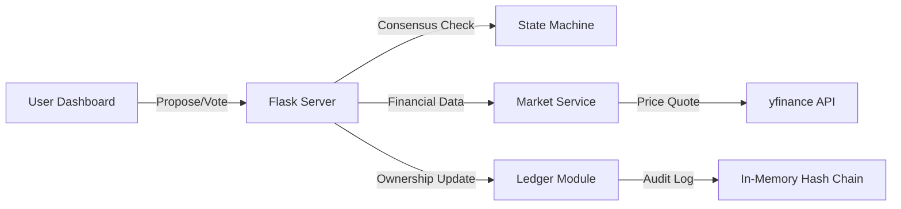

# 💎 HerFund Bloc (HFB) — Technical Documentation
### Democratic Micro-Investment Club Platform

**HerFund Bloc (HFB)** is a high-fidelity investment club platform designed specifically to bridge the gender investment gap. It allows small groups (5-10 people) to pool capital (Real and Demo), propose trades, and execute them only when a strict mathematical consensus is reached.

---

## 🏗️ System Architecture & Data Flow

The platform is built on a modular Python back-end and a glassmorphism front-end. The core logic is distributed across specialized engines to ensure reliability and auditability.

---

## 🗳️ Voting Consensus Mechanism (Problem Statement 2.1)

HFB uses a **Strict State-Machine** to govern the lifecycle of every trade. This prevents unauthorized capital drain and ensures every member has a voice.

### **State-Machine Logic**
1.  **DRAFT**: A member creates a proposal with a suggested ticker, shares, and reasoning.
2.  **VOTING**: Once submitted, a 24-hour countdown begins. Members cast `YES` or `NO` votes.
3.  **APPROVED**: The moment total `YES` votes reach the **60% Quorum** threshold.
4.  **EXECUTED**: An approved trade is manually triggered by any member, locking in the **live market price**.
5.  **EXPIRED/REJECTED**: If the 24-hour window closes without quorum, or if `NO` votes reach a majority.

> [!IMPORTANT]
> **Quorum Calculation:**
> $$Quorum = \lceil (Total Members \times 0.6) \rceil$$
> If a club has 5 members, 3 `YES` votes are required for approval. Abstentions count as `PENDING`.

---

## 📒 Multi-Signature Ledger & Fractional Ownership (PS 2.2)

The ledger acts as the "Single Source of Truth." It tracks exactly who owns what at any given moment.

### **Dynamic Ownership Mathematics**
Initial ownership is determined by the member's starting deposit. As the club's portfolio value fluctuates, the *relative ownership remains the same*, but the *liquid value* changes.

**Formula for Member Equity:**
1.  **Total Capital**: $\sum (Member\_Deposits)$
2.  **Member Share**: $S_m = \frac{D_m}{Total\_Capital}$
3.  **Current Equity**: $E_m = S_m \times (Available\_Cash + \sum (Current\_Holding\_Value))$

### **Tamper-Evident Hash Chain**
To simulate a secure, multi-signature environment, every transaction in the ledger is cryptographically linked.
- Each entry contains a `hash` and a `prev_hash`.
- If a single bit of data in a past transaction is modified, the entire subsequent chain breaks.
- **Verification**: The system runs an automated integrity check on every page load (`ledger_module.py:verify_integrity`).

---

## 📈 Real-Time Market Integration (PS 2.3)

We utilize the `yfinance` API to bridge simulated capital with real-world market movements.

- **Market Pulse**: Real-time prices are fetched during the "Create Proposal" phase to estimate the capital impact on the pool.
- **Slippage Simulation**: Because our state machine has a delay (voting window), the price at execution will differ from the price at proposal.
- **Caching Layer**: `market_service.py` implements an LRU cache to minimize API latency and handle rate limits.

---

## 🤖 AI Swarm Orchestration (Bonus Feature)

The **AI Quant Lab** demonstrates advanced parallel task management using three specialized models:

| Agent | Model (Simulated) | Responsibility |
|:------|:------------------|:---------------|
| **🔵 Gemini** | Technical Lead | Scans `yfinance` history for RSI/SMA/EMA triggers. |
| **🟢 OpenAI** | Risk Consultant | Sets Stop-Losses and calculates Volatility Risk. |
| **🟠 Claude** | Lead Architect | Synthesizes all inputs into executable Python code. |

---

## 🎮 "Unknown Cash" (UC) Demo Mode

For beginners who are risk-averse, we implemented a **Dual-Currency System**.
- **Real USD**: Subtracted from the main club pool capital.
- **Unknown Cash (UC)**: A separate $2,000 allowance per member for "practice" trades.
- UI badges (🎮 Demo) clearly distinguish practice trades from real financial commitments in the ledger and holdings list.

---

## 🛠️ Module Reference for Developers

- `server.py`: Flask entry point. Handles session management and API routing.
- `state_machine.py`: The "Engine of Consensus." Governs durations and voting math.
- `ledger_module.py`: The "Bank." Handles the hash-chain and decimal-precision ownership.
- `models.py`: Defines the shape of Clubs, Members, and Proposals.
- `quant_engine.py`: Orchestrates the parallel AI agents.
- `app.js`: Reactive UI state. Handles the "typing" animations and dynamic stat updates.

---
**Note to Team**: Use `python server.py` to launch. Ensure you have `yfinance` installed via pip. 💎
