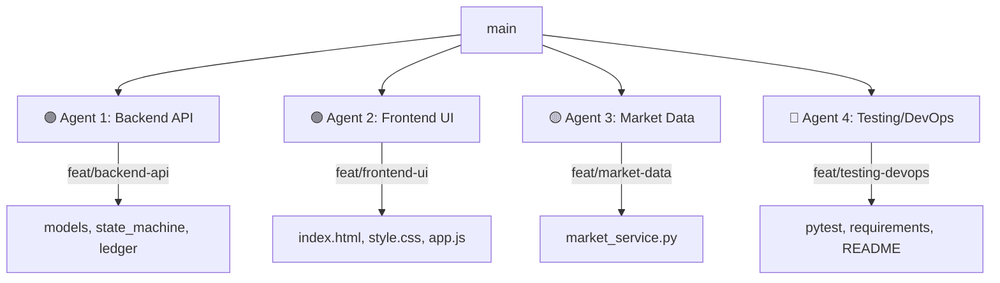

# 💎 HerFund Bloc (HFB)
### AI-Powered Democratic Micro-Investment Club Platform

**HerFund Bloc** is a specialized investment platform designed to bridge the gender investment gap by enabling small groups (5-10 people) to pool capital, learn together, and execute trades through a strict democratic consensus mechanism.

Built for the **AIC 2026 DevSwarm Hackathon (BITS Pilani APOGEE)**, this project demonstrates high-fidelity **AI Orchestration** and rigorous financial logic.

---

## 🎯 Problem Statement 2 Alignment: "Anti-Vibe" Mastered
This project is a direct response to **Problem Statement 2: Micro-Investment Club Platform**. We have architected every core feature to meet the hackathon’s strict constraints:

| Constraint | HFB Implementation & Logic | Key File |
|:--- |:--- |:--- |
| **Strict Voting Consensus** | **60-80% Quorum State-Machine**. No trade can execute without a verified quorum within a 24h window. | `state_machine.py` |
| **Multi-Signature Ledger** | **Cryptographic Hash-Chained Ledger**. Append-only with SHA-256 forward-chaining for tamper-evidence. | `ledger_module.py` |
| **Fractional Ownership** | **Dynamic Revaluation Math**. Real-time adjustment of member equity based on portfolio valuation. | `ledger_module.py` |
| **Real-Time Integration** | **Yahoo Finance Engine (yfinance)**. Live pricing during voting and for daily pool revaluation. | `market_service.py` |
| **Functional Outcome** | **Propose → Vote → Execute → Ledger**. A complete lifecycle demonstration in the browser. | `server.py` + `app.js` |

---

## 🏗️ DevSwarm Parallel Architecture
HFB was built using **parallel AI agent orchestration**. Four specialized AI agents worked simultaneously on isolated git worktrees to build the platform in a fraction of the time.



---

## 🗳️ Voting State-Machine & Quorum
The platform enforces a "No-Shortcut" state machine. A proposal is not just a database row—it is an immutable state.

### State Transitions:
1.  **DRAFT**: Proposal created (details: Symbol, Shares, Reason).
2.  **VOTING**: Window opens (Strict **24-hour** deadline countdown).
3.  **APPROVED**: Mathematical quorum (e.g., 60%) reached by club members.
4.  **REJECTED**: Threshold missed, or more NO votes cast than mathematically possible to recover from.
5.  **EXECUTED**: Trade is finalized, capital is moved, and a ledger entry is permanently hashed.
6.  **EXPIRED**: Voting window reaches 0 without a decision.

### 📐 Quorum Mathematics
We use **ceiling division** and **adaptive thresholds** to ensure group safety:
- **Small Groups (≤5)**: **80% Quorum** (Ensures a "2-person takeover" is impossible).
- **Standard Groups (6+)**: **60% Quorum** (Ensures majority consensus for liquidity).
- **Auto-Rejection**: Using the formula `can_still_reach = (yes_votes + remaining_votes) >= quorum_needed`.

---

## 📒 Cryptographic Multi-Sig Ledger
To ensure the integrity of pooled capital, HFB uses a **Forward-Chained Transaction Ledger**.

### SHA-256 Hash Chaining:
Each ledger entry (Deposit, Buy, Sell) is cryptographically linked to the one before it:
`Current Entry Hash = SHA-256( (EntryData) + (Previous_Entry_Hash) )`

**Tamper-Evidence Test**: If any member tries to "edit" a trade price or deposit amount in the database, the hash for that entry—and every subsequent entry in the chain—will break, immediately alerting the "Integrity Verified" status on the Dashboard.

---

## 📈 Dynamic Fractional Ownership Math
When a member deposits capital, their equity is calculated as a **fractional share** of the pool.

- **Formula (Equity %)**: `(Member_Contributed_Capital / Total_Pool_Capital) * 100`
- **Portfolio Revaluation**: When the club's stocks (e.g., NVDA, AAPL) gain value, the total pool market value increases. Each member's "Estimated Value" is recalculated:
`Member_Current_Value = (Total_Pool_Market_Value) * (Member_Equity_Fraction)`

This ensures that gains and losses are distributed **fairly and automatically** across all members.

---

## 🚀 DevSwarm Special: 3-Model Parallel Swarm (AI Quant Lab)
Located in the **⚙️ Quant Lab** tab, this feature demonstrates advanced multi-model orchestration. Users describe a trading problem in natural language, which triggers 3 specialized AI agents working in parallel:

1.  **🔵 Gemini (Technical Specialist)**: Analyzes historical price data and RSI/EMA crossovers.
2.  **🟢 OpenAI (Risk & Sentiment Specialist)**: Calculates optimal stop-losses and macro market risks.
3.  **🟠 Claude (Logic Synthesizer)**: Packages the raw model outputs into a production-ready **Python Algorithm Snippet** typed out in real-time in the terminal.

---

## 🎨 Design System: "The Glassmorphism UI"
HFB features a **Premium Dark Mode** dashboard designed for high engagement:
- **Glassmorphism**: Translucent panels with background blurs.
- **Micro-Animations**: Pulsing "Swarm" indicators and character-by-character terminal typing.
- **Dynamic Grid**: A 5-column dashboard tracking real Portfolio Value, Cash, **Unknown Cash (UC)**, Proposals, and Membership.

---

## 📦 Project Structure & Setup

### 1. Installation
```bash
pip install -r requirements.txt
python server.py
# → Access at http://localhost:5000
```

### 2. Core Modules
- `ledger_module.py`: Hash-chaining and fractional math.
- `state_machine.py`: Consensus logic and quorum calculation.
- `quant_engine.py`: 3-model parallel AI swarm execution.
- `market_service.py`: Real-time Yahoo Finance bridge.
- `ml_prediction.py`: Gradient Boosting model for 30-day price forecasting.

### 3. Testing
HFB includes a robust `pytest` suite verifying the core financial logic:
- `test_state_machine.py`: Verifies quorums, transitions, and 24h triggers.
- `test_ledger.py`: Verifies hash-chain integrity and tamper-detection.

---

**Team HerFund Bloc** — *Empowering small groups through democratic technology.* 💎
